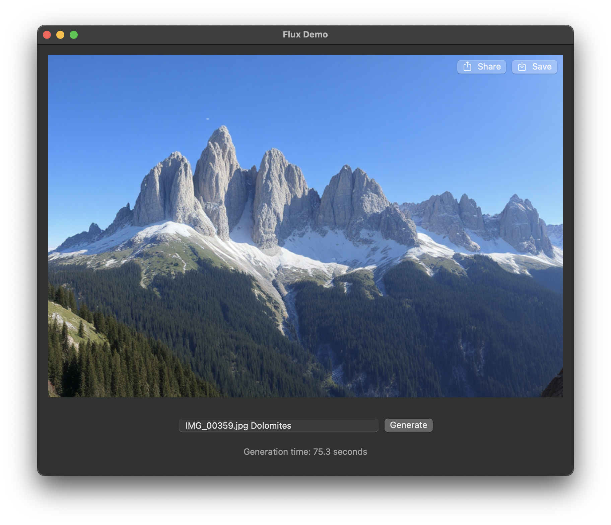

# Flux Demo

This is a simple demo app that uses [mzbac/flux.swift](https://github.com/mzbac/flux.swift) to generate images with [FLUX.1](https://blackforestlabs.ai) and MLX in Swift.

### Requirements

- 34 GB of free disk space for model files
- 11 GB of free RAM

